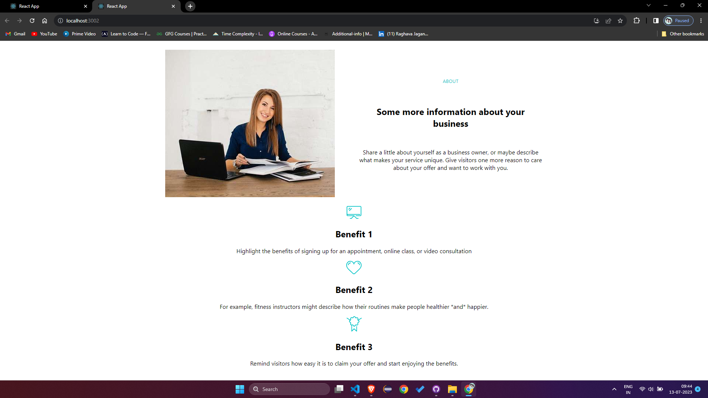
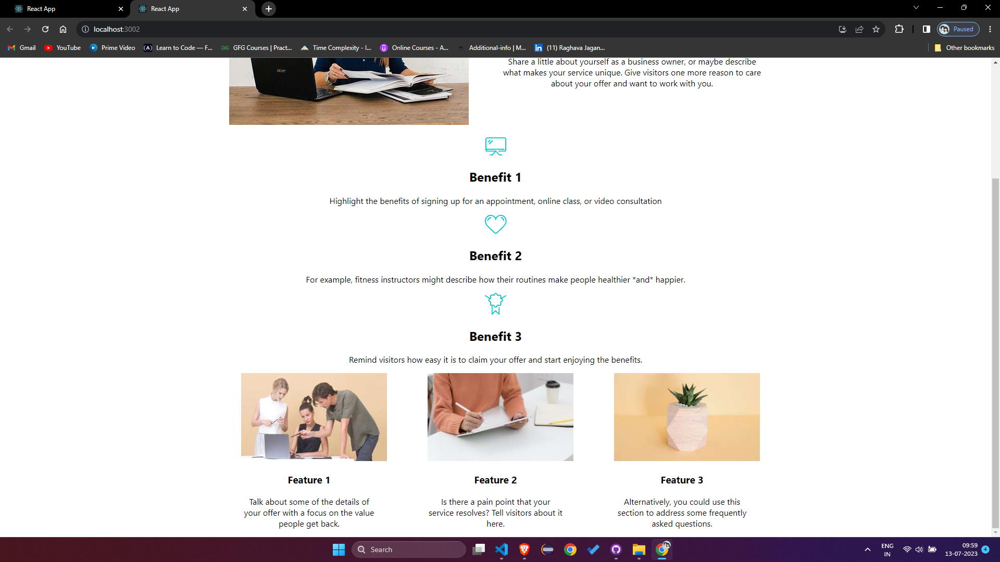
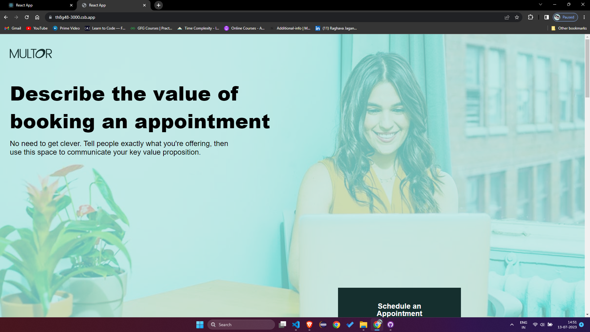
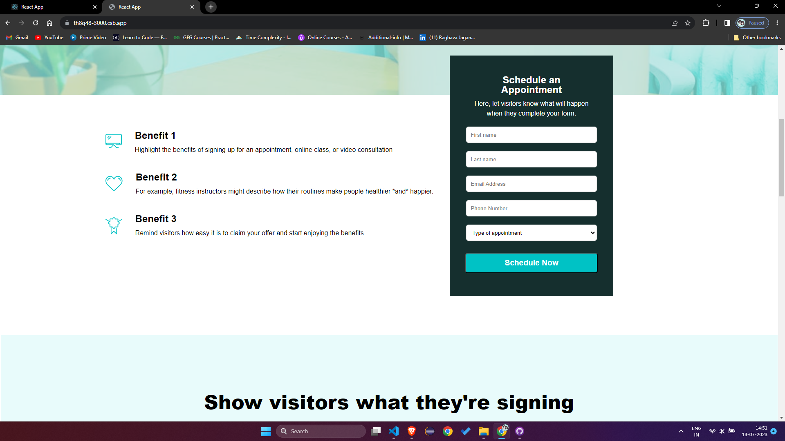
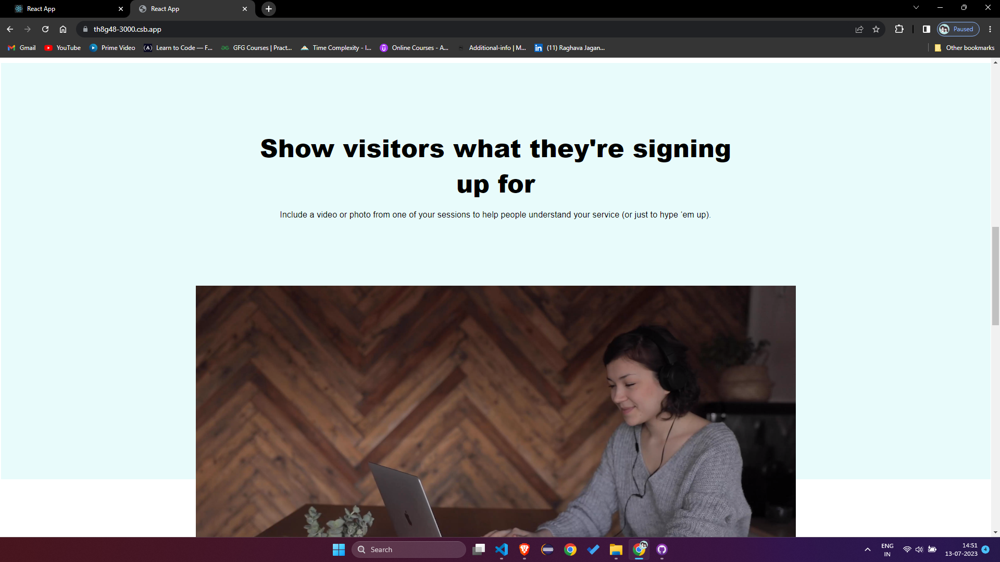
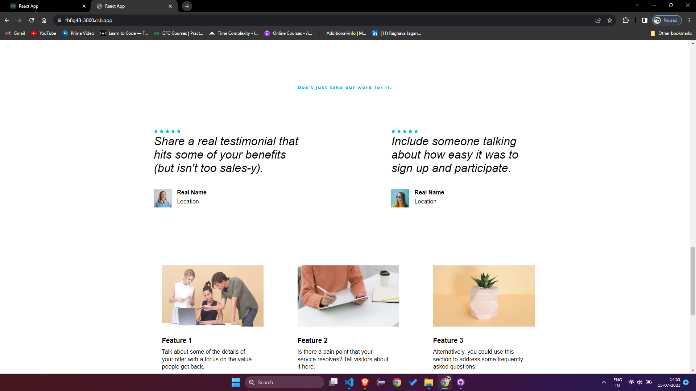
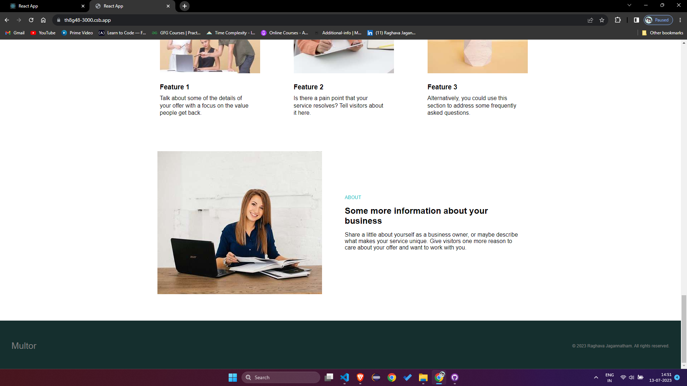

#Comet Labs

This is a landing page based on the Multor template. It showcases a modern, visually appealing design with a responsive layout and outstanding UI/UX.

## Live Demo

You can access the live demo of the Multor landing page [here](https://swqmy8-3000.csb.app/).
Code sandbox link for the code [Codesandbox link](https://codesandbox.io/p/sandbox/sleepy-carson-swqmy8?file=%2Fpublic%2Findex.html%3A1%2C1)

## Description

The Multor landing page is designed for developers with designer minds. It aims to attract talented developers and highlight the company's commitment to creativity and innovation.

## Features

- Sleek and modern design
- Fully responsive layout
- Creative use of Material-UI components
- Smooth scrolling and navigation
- Interactive sections and animations

## Technologies Used

- React.js
- Next.js
- Tailwind CSS

## Getting Started

To run the project locally, follow these steps:

1. Clone the repository:

   ```bash
   git clone https://github.com/RaghavaJagannatham/CometLabs
   ```

2. Navigate to the project directory:

   ```bash
   cd CometLabs
   ```

3. Install the dependencies:

   ```bash
   npm install
   ```

4. Run the development server:

   ```bash
   npm run dev
   ```

5. Open your browser and go to `http://localhost:3000` to view the landing page.

## Screenshots

Here are some screenshots of the Multor landing page:











## Deployment

The Multor landing page is deployed using codesandbox. You can access the live demo [here](https://swqmy8-3000.csb.app/).


## Video Demo

<!-- The script tag should live in the head of your page if at all possible -->
<script type="text/javascript" async src="https://play.vidyard.com/embed/v4.js"></script>

<!-- Put this wherever you would like your player to appear -->


You can watch a video demonstration of the CodeLabs landing page by clicking the link below:

[]()

Click on the image above or use this [direct link](./demo-video.mp4) to watch the video.


